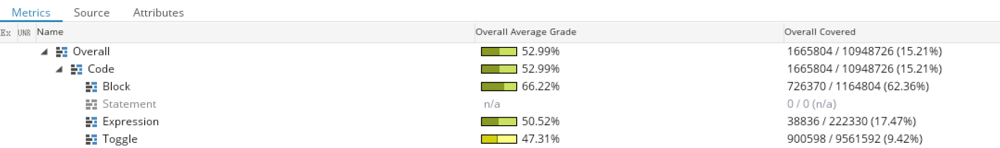

# ETROC2 cocotb

## Repository

```bash
git clone https://github.com/huangx-git/ETROC2_cocotb.git
```

## Python Environment

We use a Python virtual environment for the _ETROC2 cocotb_ verification setup. More details are provided [here](https://docs.python.org/3.10/tutorial/venv.html). To setup the Python environment for the first time:

```bash
python3.12 -m venv $HOME/venvs/cocotb-env
source $HOME/venvs/cocotb-env/bin/activate
pip install cocotb pytest
```

When the Python environment is active, you will notice the prefix `(cocotb-env)` on the command line.

To add a new Python package:

```bash
pip install NEW_PACKAGE_NAME
```

To deactivate the environment:

```bash
deactivate
```

In any new console, remember to activate the environment:

```bash
source $HOME/venvs/cocotb-env/bin/activate
```

## CAD Tools

Besides the Python virtual environment that provides cocotb and other Python libraries, you need the following CAD tools:

- **Cadence _Xcelium_** (Logic Simulator), tested with _v23.09_
~~- **Cadence _vManager_** (Verification Manager), tested with _v24.03_~~

**NOTE** If you are using the servers of `sphy7asic01`, or `sphy7asic02`, the following script(s) will be loaded to setup the environment:

`start.sh` in cocotb directory

```bash
source start.sh
```

Please copy those scripts and adapt them to your needs.


Follow these [instructions](SETUP.md) to clone the repository and set up the Python and CAD tool environments. After the initial setup, always remember to activate the Python environment:

```bash
source $HOME/venvs/cocotb-env/bin/activate
```

## Test cases

The top directory for the cocotb test cases is [cocotb](cocotb). The cocotb verification environment for ETROC2 (as for any cocotb project) uses Makefiles to define how to run the simulator, set up necessary environment variables, and configure the simulation parameters.

```bash
cd cocotb
make help
```

### Configuration registers monitor after reset

This test case monitors the configuration registers of the peripherals after reset. The reset values for the registers are specified under the _Default_ column in _Table 12: Peripheral Configuration Registers_ of the [ETROC2 manual](https://www.overleaf.com/project/63d18c8068a93c554632fff0).

To run the test case:
```bash
make sim TESTCASE=test_peripheral_config_registers_on_reset
```

The simulation time is approx. 13 minutes on the sphy7asic01 cluster. The expect output is:

```
xcelium> run
     0.00ns INFO     cocotb                             Running on xmsim(64) version 23.09-s004
     0.00ns INFO     cocotb                             Running tests with cocotb v1.9.0 from /users/xingh/venvs/cocotb-env/lib64/python3.12/site-packages/cocotb
     0.00ns INFO     cocotb                             Seeding Python random module with 1721685942
     0.00ns INFO     cocotb.regression                  Found test main.test_peripheral_config_registers_on_reset
     0.00ns INFO     cocotb.regression                  running test_peripheral_config_registers_on_reset (1/1)
                                                          Test function for peripheral configuration registers on reset.
                                                          
                                                          Args:
                                                              dut: The DUT (Device Under Test) object.
                                                          
                                                          Returns:
                                                              None
     0.00ns INFO     cocotb.ETROC2_tb                   BEGIN test_peripheral_config_registers_on_reset
     0.00ns INFO     cocotb.ETROC2_tb                   BEGIN driver_peripheral_config_registers_on_reset
     0.00ns INFO     cocotb.ETROC2_tb                   BEGIN monitor_peripheral_config_registers_on_reset
  6000.00ns INFO     cocotb.ETROC2_tb                   AFTER RSTN monitor_peripheral_config_registers_on_reset
  6000.00ns INFO     cocotb.ETROC2_tb                   END   monitor_peripheral_config_registers_on_reset
  6596.00ns INFO     cocotb.ETROC2_tb                   END   driver_peripheral_config_registers_on_reset
  6596.00ns INFO     cocotb.ETROC2_tb                   TB (cocotb) done!
  6596.00ns INFO     cocotb.ETROC2_tb                   END   test_peripheral_config_registers_on_reset
  6596.00ns INFO     cocotb.regression                  test_peripheral_config_registers_on_reset passed
  6596.00ns INFO     cocotb.regression                  ********************************************************************************************************
                                                        ** TEST                                            STATUS  SIM TIME (ns)  REAL TIME (s)  RATIO (ns/s) **
                                                        ********************************************************************************************************
                                                        ** main.test_peripheral_config_registers_on_reset   PASS        6596.00          55.44        118.97  **
                                                        ********************************************************************************************************
                                                        ** TESTS=1 PASS=1 FAIL=0 SKIP=0                                 6596.00          56.78        116.17  **
                                                        ********************************************************************************************************
                                                        
Simulation complete via $finish(1) at time 6596000100 FS + 0
xcelium> exit
TOOL:	xrun(64)	23.09-s004: Exiting on Jul 22, 2024 at 17:06:38 CDT  (total: 00:13:09)

```

Successful test cases are marked as `PASS`, otherwise `FAIL`.


To enable the GUI and observe waveforms:

```bash
make sim GUI=1 TESTCASE=test_peripheral_config_registers_on_reset
```

In Xcelium GUI, first click `File >> Source Command Script >> Filename >> waveforms/restore_waveform_i2c_regs.tcl.svcf`, then click on `Simulation >> Run`.

<details>
  <summary>Show image for I2C waveform view</summary>
  
</details>

<br>


The reset pulse and the assertions on the configuration registers are specified in [cocotb/py/tb_peripheral_config_registers_on_reset.py](cocotb/py/tb_peripheral_config_registers_on_reset.py). Please refer to the code for more details.

### FastCommand and I2C Drivers

The _FastCommand and I2C Drivers_ simplify the process of providing stimuli for the ETROC2 design without the need to code them in Python or SystemVerilog.

For simplicity, you can run it as:

```bash
make sim TESTCASE=test_file_base_stimuli
```

The simulation time is approx. 70 minutes on the _ME Division_ cluster. The expect output is:

```
230800.00ns INFO     cocotb.ETROC2_tb                   BEGIN i2c_write_single
230800.00ns INFO     cocotb.ETROC2_tb                     - slave_addr : LogicArray('1100111', Range(6, 'downto', 0)) (0x67)
230800.00ns INFO     cocotb.ETROC2_tb                     - reg_addr   : LogicArray('1001110111000001', Range(15, 'downto', 0)) (0x9dc1)
230800.00ns INFO     cocotb.ETROC2_tb                     - data       : LogicArray('00111111', Range(7, 'downto', 0)) (0x3f)
230800.00ns INFO     cocotb.ETROC2_tb                     - report_error: True
241325.00ns INFO     cocotb.ETROC2_tb                   END   i2c_write_single
241325.00ns INFO     cocotb.ETROC2_tb                   END   i2c_pixel_write
241825.00ns INFO     cocotb.ETROC2_tb                   END   driver_i2c
308653.80ns INFO     cocotb.ETROC2_tb                   END   driver_fc
308653.80ns INFO     cocotb.ETROC2_tb                   TB (cocotb) done!
308653.80ns INFO     cocotb.ETROC2_tb                   END   test_file_base_stimuli
308653.80ns INFO     cocotb.regression                  test_file_base_stimuli passed
308653.80ns INFO     cocotb.regression                  **************************************************************************************
                                                        ** TEST                          STATUS  SIM TIME (ns)  REAL TIME (s)  RATIO (ns/s) **
                                                        **************************************************************************************
                                                        ** main.test_file_base_stimuli    PASS      308653.80        3408.43         90.56  **
                                                        **************************************************************************************
                                                        ** TESTS=1 PASS=1 FAIL=0 SKIP=0             308653.80        3408.87         90.54  **
                                                        **************************************************************************************
                                                        
Simulation complete via $finish(1) at time 308653800100 FS + 0
```

To enable the GUI and observe waveforms:

```bash
make sim GUI=1 TESTCASE=test_file_base_stimuli
```

In Xcelium GUI, first click `File >> Source Command Script >> Filename >> waveforms/restore_waveform_general.tcl`, then click on `Simulation >> Run`.

The test case loads the FastCommand and I2C operations from files, [cocotb/csv/fc_tb_inputs.csv](cocotb/csv/fc_tb_inputs.csv) and [cocotb/csv/i2c_tb_inputs.csv](cocotb/csv/i2c_tb_inputs.csv), and applies them to the DUT ports using a properly timed sequence of inputs. The following images show the FastCommand and I2C drivers.

#### FastCommand Driver

<details>
  <summary>Show image for FastCommand driver</summary>
  
</details>

<br>

The provided [cocotb/csv/fc_tb_inputs.csv](cocotb/csv/fc_tb_inputs.csv) file shows a possible sequence of stimuli as comma-separated values.

**NOTE** The verification engineer can edit directly the provided file or provide a new one by editing [cocotb/py/main.py](cocotb/py/main.py):

```python
# Start I2C signal driver
task_driver_2 = cocotb.start_soon(driver_i2c(dut, i2c_stimuli_csv='csv/i2c_tb_inputs.csv'))
```

#### Syntax of FastCommand CSV file

The first entry for each line in the configuration file (e.g. [cocotb/csv/fc_tb_inputs.csv](cocotb/csv/fc_tb_inputs.csv)) is the FastCommand, while the second entry is the number of times the FastCommand should be applied. For example, `IDLE` will be sent 7300 times, after that a single `ChargeInj` follows, etc.

The list of available FastCommands are reported in the table below together with their Binary and Hex encoding.

| FastCommand  | Binary Value | Hex Value |
|--------------|--------------|-----------|
| IDLE         | 11110000     | F0        |
| LinkReset    | 00110011     | 33        |
| BCR          | 01011010     | 5A        |
| SyncForTrig  | 01010101     | 55        |
| L1A_CR       | 01100110     | 66        |
| ChargeInj    | 01101001     | 69        |
| L1A          | 10010110     | 96        |
| L1A_BCR      | 10011001     | 99        |
| WS_Start     | 10100101     | A5        |
| WS_Stop      | 10101010     | AA        |

#### I2C Driver

<details>
  <summary>Show image for I2C driver</summary>
  
</details>

<br>

The provided [cocotb/csv/fc_i2c_inputs.csv](cocotb/csv/i2c_tb_inputs.csv) file shows a possible sequence of stimuli as comma-separated values.

**NOTE** The verification engineer can edit directly the provided file or provide a new one by editing [cocotb/py/main.py](cocotb/py/main.py):

```python
# Start FastCommand driver
fc_start_delay_ps = clock_info_dict['CLK40'][1]
task_driver_3 = cocotb.start_soon(driver_fc(dut, start_delay_ps=fc_start_delay_ps, fc_stimuli_csv='csv/fc_tb_inputs.csv'))
```

#### Syntax of I2C CSV file

For each line in the configuration file (e.g. [cocotb/csv/i2c_tb_inputs.csv](cocotb/csv/i2c_tb_inputs.csv)):

- The first entry is the simulation time in nanoseconds (ns) when the I2C command should be performed.
- The second entry is the I2C command.
- The following entries are payload values for the I2C command. Different I2C commands may require a different list of payload values.

This is the list of the available I2C commands and associated payloads values:

1. `i2c_nop` is the _no-operation_ command; it does not require any payload value.
2. `i2c_write_single` write the configuration register of a device on the I2C bus; it requires 3 payloads:
    - `i2c_dev_addr` is the I2C device address and in our setup it is usually `0x67`;
    - `i2c_reg_addr` is the register address;
    - `i2c_reg_data` is the value to write into the register.
3. `i2c_pixel_bc` write on all of the pixels (broadcast); it requires 5 payload values:
    - `i2c_dev_addr` is the I2C device address and in our setup it is usually `0x67`;
    - `i2c_pixel_x` in broadcast mode (set to `0xf`);
    - `i2c_pixel_y` in broadcast mode (set to `0xf`);
    - `i2c_pixel_config` is the pixel configuration value;
    - `i2c_pixel_addrin` is the pixel register address;
4. `i2c_pixel_write` write on a specific pixel of (X,Y) coordinates; it requires 5 payload values:
    - `i2c_dev_addr` is the I2C device address and in our setup it is usually `0x67`;
    - `i2c_pixel_x` the X-coordinate of the pixel;
    - `i2c_pixel_y` the Y-coordinate of the pixel;
    - `i2c_pixel_config` is the pixel configuration value;
    - `i2c_pixel_addrin` is the pixel register address.

#### Monitoring FastCommand and output traces

Serial and parallel traces for FastCommand and outputs are saved on files. See [cocotb/py/tb_file_based_stimuli](cocotb/py/tb_file_based_stimuli/monitor.py):

```python
# Start FastCommand and data-out-right tracing
task_fc_monitor = cocotb.start_soon(monitor_fc(dut, serial_filename='fc_serial.cocotb.txt', parallel_filename='fc_parallel.cocotb.txt'))
task_dor_monitor = cocotb.start_soon(monitor_dor(dut, serial_filename='dor_serial.cocotb.txt', parallel_filename='dor_parallel.cocotb.txt'))
```

#### Some I2C operation examples

1) Configure the phase shifter to define a proper measurement window:

   ```csv
   148,i2c_write_single,0x67,0x0005,0x80
   ```

   Run `i2c_write_single` command after _148ns_, where:

   - `i2c_dev_addr` = `0x67`
   - `i2c_reg_addr` = `0x0005`
   - `i2c_reg_data` = `0x80`

2) Disable the scrambler:

   ```csv
   148,i2c_write_single,0x67,0x0013,0x57
   ```

   Run `i2c_write_single` command after _148ns_, where:

   - `i2c_dev_addr` = `0x67`
   - `i2c_reg_addr` = `0x0013`
   - `i2c_reg_data` = `0x57`


## Coverage analysis

When running simulations with any test case of your choice, you can enable coverage collection (`COV=1`), as an example:

```bash
make sim COV=1 TESTCASE=test_peripheral_config_registers_on_reset
```

This will create a UCDB file (Unified Coverage Database) in the directory `cocotb/cov_work`:

```
coverage setup:
  workdir  :  ./cov_work
  dutinst  :  ETROC2_tb(ETROC2_tb)
  scope    :  scope
  testname :  test

coverage files:
  model(design data) :  ./cov_work/scope/icc_24108ea1_00000000.ucm
  data               :  ./cov_work/scope/test/icc_24108ea1_00000000.ucd
```

To visualize the results in the Cadence Integrated Metric Center (IMC):

```bash
make show-coverage-results
```
<details>
  <summary>Show coverage in Cadence IMC</summary>
  
</details>
<br>

**NOTE** You can combine the coverage `COV=1` and `GUI=1` options.



## Misc

This [document](https://github.com/Fermilab-Microelectronics/ETROC2_RefManualNotes/blob/main/ETROC2_RefManualNotes.md) contains notes on the ETROC2 manual maintained on [Overleaf](https://www.overleaf.com/project/63d18c8068a93c554632fff0).
